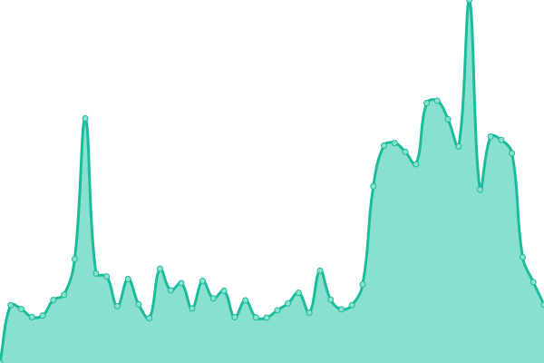
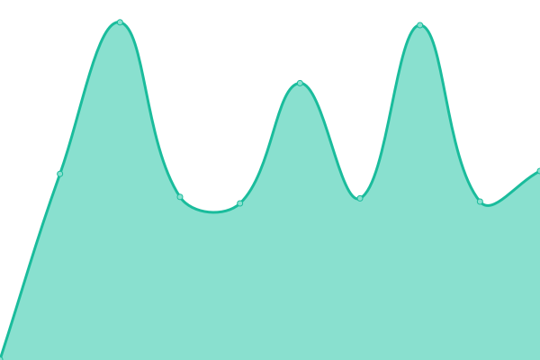
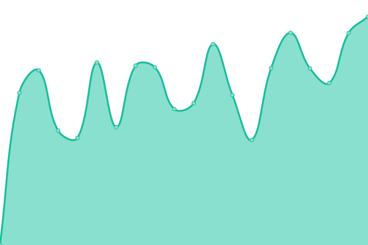

# [📈 Live Status](https://status.zyradyl.moe): <!--live status--> **🟧 Partial outage**

This repository contains the open-source uptime monitor and status page for [Zyradyl.moe](https://zyradyl.moe), powered by [Upptime](https://github.com/upptime/upptime).

With [Upptime](https://upptime.js.org), you can get your own unlimited and free uptime monitor and status page, powered entirely by a GitHub repository. We use [Issues](https://github.com/zyradyl-moe/status-page/issues) as incident reports, [Actions](https://github.com/zyradyl-moe/status-page/actions) as uptime monitors, and [Pages](https://status.zyradyl.moe) for the status page.

<!--start: status pages-->
<!-- This summary is generated by Upptime (https://github.com/upptime/upptime) -->
<!-- Do not edit this manually, your changes will be overwritten -->
<!-- prettier-ignore -->
| URL | Status | History | Response Time | Uptime |
| --- | ------ | ------- | ------------- | ------ |
|  Auth Portal | 🟩 Up | [auth-portal.yml](https://github.com/zyradyl-moe/status-page/commits/HEAD/history/auth-portal.yml) | 

 600ms
     
 | 

<a href="https://status.zyradyl.moe/history/auth-portal">100.00%</a>
    

|  Cloud Services | 🟥 Down | [cloud-services.yml](https://github.com/zyradyl-moe/status-page/commits/HEAD/history/cloud-services.yml) | 

 0ms
     
 | 

<a href="https://status.zyradyl.moe/history/cloud-services">6.10%</a>
    

|  Maple - Admin Portal | 🟩 Up | [maple-admin-portal.yml](https://github.com/zyradyl-moe/status-page/commits/HEAD/history/maple-admin-portal.yml) | 

 517ms
     
 | 

<a href="https://status.zyradyl.moe/history/maple-admin-portal">100.00%</a>
    

|  Maple - Request Service | 🟩 Up | [maple-request-service.yml](https://github.com/zyradyl-moe/status-page/commits/HEAD/history/maple-request-service.yml) | 

 1097ms
     
 | 

<a href="https://status.zyradyl.moe/history/maple-request-service">100.00%</a>
    

|  Maple - User Portal | 🟩 Up | [maple-user-portal.yml](https://github.com/zyradyl-moe/status-page/commits/HEAD/history/maple-user-portal.yml) | 

 621ms
     
 | 

<a href="https://status.zyradyl.moe/history/maple-user-portal">100.00%</a>
    

|  Maple - Watch Service | 🟩 Up | [maple-watch-service.yml](https://github.com/zyradyl-moe/status-page/commits/HEAD/history/maple-watch-service.yml) | 

 757ms
     
 | 

<a href="https://status.zyradyl.moe/history/maple-watch-service">100.00%</a>
    

|  Storj Node Service | 🟥 Down | [storj-node-service.yml](https://github.com/zyradyl-moe/status-page/commits/HEAD/history/storj-node-service.yml) | 

 0ms
     
 | 

<a href="https://status.zyradyl.moe/history/storj-node-service">4.90%</a>
    

<!--end: status pages-->

[**Visit our status website →**](https://status.zyradyl.moe)

## 📄 License

- Powered by: [Upptime](https://github.com/upptime/upptime)
- Code: [MIT](./LICENSE) © [Zyradyl.moe](https://zyradyl.moe)
- Data in the `./history` directory: [Open Database License](https://opendatacommons.org/licenses/odbl/1-0/)
