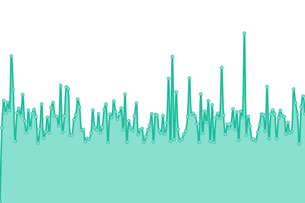
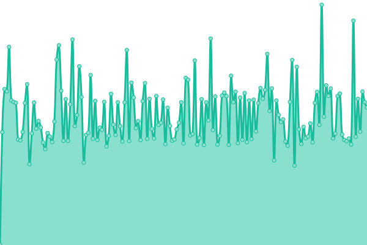

# [📈 Live Status](https://status.zyradyl.moe): <!--live status--> **🟩 All systems operational**

This repository contains the open-source uptime monitor and status page for [Zyradyl.moe](https://zyradyl.moe), powered by [Upptime](https://github.com/upptime/upptime).

With [Upptime](https://upptime.js.org), you can get your own unlimited and free uptime monitor and status page, powered entirely by a GitHub repository. We use [Issues](https://github.com/zyradyl-moe/status-page/issues) as incident reports, [Actions](https://github.com/zyradyl-moe/status-page/actions) as uptime monitors, and [Pages](https://status.zyradyl.moe) for the status page.

<!--start: status pages-->
<!-- This summary is generated by Upptime (https://github.com/upptime/upptime) -->
<!-- Do not edit this manually, your changes will be overwritten -->
<!-- prettier-ignore -->
| URL | Status | History | Response Time | Uptime |
| --- | ------ | ------- | ------------- | ------ |
|  [Auth Portal](https://auth.zyradyl.moe) | 🟩 Up | [auth-portal.yml](https://github.com/zyradyl-moe/status.zyradyl.moe/commits/HEAD/history/auth-portal.yml) | 

 1279ms
     
 | 

<a href="https://status.zyradyl.moe/history/auth-portal">100.00%</a>
    

|  [Maple - Access Portal](https://maple.zyradyl.moe) | 🟩 Up | [maple-access-portal.yml](https://github.com/zyradyl-moe/status.zyradyl.moe/commits/HEAD/history/maple-access-portal.yml) | 

 1503ms
     
 | 

<a href="https://status.zyradyl.moe/history/maple-access-portal">99.94%</a>
    

|  [Maple - Cloud Services](https://files.zyradyl.moe) | 🟩 Up | [maple-cloud-services.yml](https://github.com/zyradyl-moe/status.zyradyl.moe/commits/HEAD/history/maple-cloud-services.yml) | 

 1603ms
     
 | 

<a href="https://status.zyradyl.moe/history/maple-cloud-services">98.66%</a>
    

|  [Maple - Media Browser](https://browse.zyradyl.moe) | 🟩 Up | [maple-media-browser.yml](https://github.com/zyradyl-moe/status.zyradyl.moe/commits/HEAD/history/maple-media-browser.yml) | 

 1378ms
     
 | 

<a href="https://status.zyradyl.moe/history/maple-media-browser">100.00%</a>
    

|  [Maple - Request Service](https://request.zyradyl.moe) | 🟩 Up | [maple-request-service.yml](https://github.com/zyradyl-moe/status.zyradyl.moe/commits/HEAD/history/maple-request-service.yml) | 

 1883ms
     
 | 

<a href="https://status.zyradyl.moe/history/maple-request-service">100.00%</a>
    

|  [Maple - Watch Service](https://watch.zyradyl.moe) | 🟩 Up | [maple-watch-service.yml](https://github.com/zyradyl-moe/status.zyradyl.moe/commits/HEAD/history/maple-watch-service.yml) | 

 1479ms
     
 | 

<a href="https://status.zyradyl.moe/history/maple-watch-service">99.94%</a>
    

|  [Storj Node Service](storj.zyradyl.moe) | 🟩 Up | [storj-node-service.yml](https://github.com/zyradyl-moe/status.zyradyl.moe/commits/HEAD/history/storj-node-service.yml) | 

 247ms
     
 | 

<a href="https://status.zyradyl.moe/history/storj-node-service">100.00%</a>
    

<!--end: status pages-->

[**Visit our status website →**](https://status.zyradyl.moe)

## 📄 License

- Powered by: [Upptime](https://github.com/upptime/upptime)
- Code: [MIT](./LICENSE) © [Zyradyl.moe](https://zyradyl.moe)
- Data in the `./history` directory: [Open Database License](https://opendatacommons.org/licenses/odbl/1-0/)
